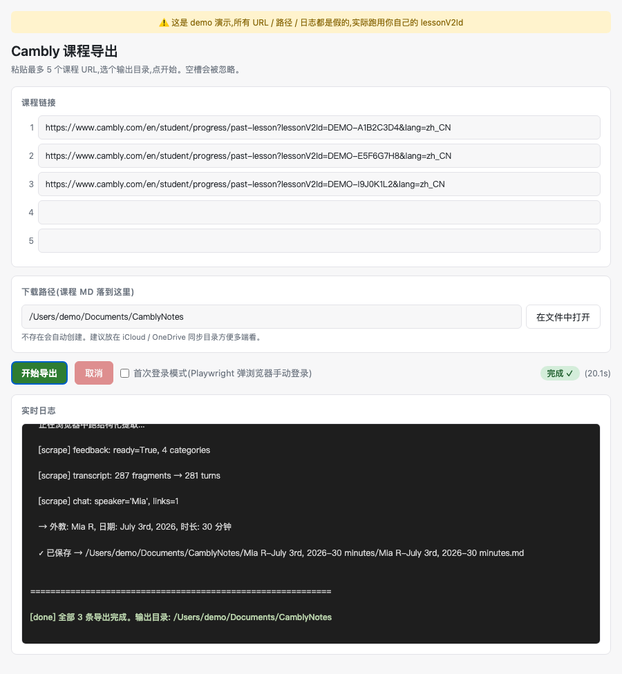

# Cambly 课程工作流

两件套,把 Cambly 课程从"网页里翻不到"变成"Obsidian 里可复习":

| 工具 | 作用 | 形态 |
|------|------|------|
| **`cambly_export.py`** | 把 Cambly 网页版 past-lesson 导出为结构化 Markdown(元信息 + AI 反馈 + Transcript + Chat + Slides) | CLI 脚本 |
| **`cambly_gui.py`** | `cambly_export.py` 的 GUI 外壳,粘贴 1-5 个 URL + 下载路径,实时看日志 | 浏览器标签页(stdlib http.server + 自动开浏览器) |
| **`cambly-review` skill** | 对导出的 Markdown 做 5 维结构化 review(词汇 / 方法论 / 注意事项 / 纠错 / 句式),产出 `*-review.md` 配合 Obsidian 使用 | Mavis / Claude Code / Codex skill |

**典型工作流**:
```
Cambly 网页 ──[cambly_export.py]──> 单节课 .md ──[cambly-review]──> 复习笔记 .md
```

## 演示(30 秒看完整流程)

[](demo/video/demo.mp4)

[▶ 直接打开 mp4](demo/video/demo.mp4) · [静态预览](demo/demo_final_state.png) · [源文件 + 重录](demo/README.md)

> ⚠️ 演示中的 URL 用 `DEMO-XXX`、路径用 `/Users/demo/...`,均为假数据,实际跑用你自己的 `lessonV2Id`。
>
> **GitHub 渲染说明**:如果上方是缩略图而不是视频播放器,说明 GitHub 没自动 embed(GitHub 对大 mp4 偶尔抽风),点缩略图或「直接打开 mp4」即可看。
>
> 想看嵌入式版本:复制 `https://raw.githubusercontent.com/LJNotte/camblylesson_download/main/demo/video/demo.mp4` 到第三方 markdown 渲染器(markdown 视频直接显示)。

---

# 快速开始(30 秒跑通)

```bash
# 1. 装依赖
cd /Users/llazuli/Documents/MiniMax/Cambly
pip install -r requirements.txt
python3 -m playwright install chromium

# 2. 第一次登一次(弹浏览器手动登,cookie 落盘到 ~/.cambly_export/)
python3 cambly_export.py "https://www.cambly.com/en/student/progress/past-lesson?lessonV2Id=任意一节&lang=zh_CN" --login

# 3. 导出一节
python3 cambly_export.py "https://www.cambly.com/.../?lessonV2Id=...&lang=zh_CN" --out ~/Documents/CamblyNotes

# 4. (可选)用浏览器标签页 GUI 代替命令行
python3 cambly_gui.py
```

> 跑通后:**详细 CLI 用法看 [第一节](#一cambly_exportpy--导出工具),GUI 用法看 [第二节](#二cambly_guipy--浏览器标签页-gui可选)。**

---

# 一、`cambly_export.py` — 导出工具

把 Cambly 网页版已结束课程(past-lesson)导出为结构化 Markdown,
落到 `Tutor-Date-Duration` 自动命名的文件夹里。

> **CLI 工具 + 可选浏览器标签页 GUI**(`cambly_gui.py`),一次可传多个 URL 串行导出。
> 想要可视化界面就跑 `cambly_gui.py`(零额外依赖);只想要命令行也行,不影响。

## 1. 安装(一次性)

需要 Python 3.9+。

```bash
cd /Users/llazuli/Documents/MiniMax/Cambly
pip3 install --user -r requirements.txt
python3 -m playwright install chromium
```

> 第一次跑 `--login` 时,工具会用 Playwright 自带的 Chromium 弹窗,
> 不会动你日常 Chrome 的登录态。Cookie 缓存在 `~/.cambly_export/chrome-profile/`。

## 2. 第一次跑:登录 Cambly

Cambly 整站都要登录,先手动登一次让 cookie 落盘:

```bash
python3 cambly_export.py "https://www.cambly.com/en/student/progress/past-lesson?lessonV2Id=你的lessonV2Id&lang=zh_CN" --login
```

流程:弹 Chromium 窗口 → 手动登录 → 看到课程页 → 回终端按 Enter。

之后所有导出都不用再登(cookie 失效时再跑一次 `--login`)。

## 3. 日常使用

### 3.1 导出单条课程

```bash
python3 cambly_export.py "<cambly课程url>" --out ~/Documents/CamblyNotes
```

`<cambly课程url>` 形如:
```
https://www.cambly.com/en/student/progress/past-lesson?lessonV2Id=6a43e8da323f6f28ee64d728&lang=zh_CN
```

> `lessonV2Id` 在 Cambly 网页版 past-lesson 页面 URL 里。
> 不带 `--out` 默认输出到当前目录。

### 3.2 批量导出(串行)

```bash
python3 cambly_export.py \
    "<url1>" "<url2>" "<url3>" \
    --out ~/Documents/CamblyNotes
```

每条独立文件夹,前一条跑完再跑下一条(每条约 30-60s,主要等 Cambly AI 反馈异步生成)。

### 3.3 运行时的输出

```
============================================================
[1/3] https://www.cambly.com/.../past-lesson?lessonV2Id=xxxx
============================================================
[info] 正在打开课程页: https://www.cambly.com/...
[scrape] 正在浏览器中跑结构化提取...
[scrape] feedback: ready=True, 4 categories
[scrape] transcript: 559 fragments → 542 turns
[scrape] chat: speaker='Leon', links=2
[scrape] slides: unavailable=False
   → 外教: Dennis D, 日期: July 1st, 2026, 时长: 60 分钟
   ✓ 已保存 → /Users/.../CamblyNotes/Dennis D-July 1st, 2026-60 minutes/Dennis D-July 1st, 2026-60 minutes.md

============================================================
[done] 全部 3 条导出完成。输出目录: /Users/llazuli/Documents/CamblyNotes
============================================================
```

## 4. 全部参数

| 参数 | 作用 |
|------|------|
| `urls` (位置参数,必填,可多个) | Cambly 课程 URL,空格分隔 |
| `--login` | 弹浏览器手动登录(首次或 cookie 失效时) |
| `--out <dir>` | 输出目录(默认当前目录) |
| `--debug-html <file>` | 把抓到的页面 HTML 落盘(只对第 1 个 URL 生效,排查用) |
| `--screenshots <dir>` | 把每个 tab 截图落盘(同上,只对第 1 个 URL) |

```bash
# 出问题时排查:把 DOM 和每个 tab 的截图都存下来
python3 cambly_export.py "<url>" --debug-html ./debug.html --screenshots ./shots

# 走完一次登录流程(用同一份 cookie)
python3 cambly_export.py "<url>" --login --out ~/Documents/CamblyNotes
```

## 5. 输出结构

```
<--out 指定的目录>/
  Dennis D-July 1st, 2026-60 minutes/
    Dennis D-July 1st, 2026-60 minutes.md
  Sara K-June 28th, 2026-30 minutes/
    Sara K-June 28th, 2026-30 minutes.md
  ...
```

文件夹 / 文件名都来自 feedback tab 的「From Cambly」上方的教师信息:
**外教姓名 - 课程日期 - 时长**。三者任一缺失会回退到 `Unknown XXX`。

每份 `.md` 包含 5 个 section:
1. 元信息(Lesson ID、URL、外教、日期、时长、Speaking%/WPM/Unique words)
2. **课程总结 · AI 反馈**(From Cambly,按 Grammar/Vocabulary/Pronunciation/... 分类)
3. **语音转文字(Transcript)** — 559 个 ASR 片段合并为 ~540 个 turn,按 speaker 标注
4. **课堂聊天(Chat)** — 课内聊天窗的文本 + 链接
5. **课件(Slides)** — 课件文本(无课件则标注「未使用」)

---

# 二、`cambly_gui.py` — 浏览器标签页 GUI(可选)

> 把 `cambly_export.py` 包了一层,可视化填 URL + 选下载路径 + 实时看日志。
> **零额外依赖** —— 不装 pywebview / PySide / Tk,直接用 Python stdlib `http.server` 起本地服务,
> 自动用你电脑的默认浏览器打开。**CLI 完全不受影响**。

## 0. GUI 跟 CLI 怎么选?

| 场景 | 推荐 |
|------|------|
| 临时导 1-2 节,跟手动操作穿插 | **GUI**(可视化、能看进度、误操作容易停) |
| 一口气导 5 节,跑完不看了 | CLI(写个 shell 循环后台跑) |
| 写脚本/自动化 | CLI(`cambly_export.py` 适合 shell 串接) |
| 给不熟 CLI 的朋友/家人用 | **GUI**(打开就能用) |
| 远程 / SSH | CLI(GUI 需要本地浏览器) |

底层完全等价 —— GUI 就是 `cambly_export.py` 的薄壳,导出文件格式、cookie、行为都一样。

## 1. 启动 GUI

```bash
# 1. 装依赖(同 CLI,只要 playwright)
cd /Users/llazuli/Documents/MiniMax/Cambly
pip install -r requirements.txt
python3 -m playwright install chromium

# 2. 启 GUI
python3 cambly_gui.py
```

终端会打印:
```
============================================================
[cambly-gui] 本地服务已启动: http://127.0.0.1:53187/
[cambly-gui] 1.5 秒后自动用默认浏览器打开...
[cambly-gui] 如果没自动打开,请手动访问上面的 URL
[cambly-gui] Ctrl+C 退出(同时会终止正在跑的导出子进程)
============================================================
```

浏览器自动打开 → 看到表单 → 第一次用?继续看下面 **2. 第一次跑(登一次)**;已经登过?直接看 **3. 日常使用**。

## 2. 第一次跑(登一次)

Cambly 整站都要登录,第一次用 GUI 必须先让 cookie 落盘。

**两条路径二选一:**

**路径 A:在终端 `--login`(推荐,简单)**

```bash
python3 cambly_export.py "https://www.cambly.com/en/student/progress/past-lesson?lessonV2Id=任何一节&lang=zh_CN" --login
```

弹 Chromium → 手动登录 → 看到课程页 → 回终端按 Enter。cookie 落到 `~/.cambly_export/chrome-profile/`,以后所有调用都复用,GUI 不用再勾「登录模式」。

**路径 B:在 GUI 里勾「登录模式」**

GUI 里勾上「首次登录模式」→ 点「开始导出」→ Playwright 弹 Chromium 让你登 → 登完回终端按 Enter → 之后继续走导出流程。cookie 同样落盘。

> 两条路径等价,选你觉得方便的。日常推荐 A,GUI 跑着跑着 cookie 失效了再用 B 重新登。

## 3. 日常使用(已登过后)

```
┌────────────────────────────────────────┐
│  Cambly 课程导出                        │
├────────────────────────────────────────┤
│  课程链接                                │
│  1 [https://www.cambly.com/...past-...] │
│  2 [(可选)]                              │
│  3 [(可选)]                              │
│  4 [(可选)]                              │
│  5 [(可选)]                              │
├────────────────────────────────────────┤
│  下载路径(课程 md 落到这里)             │
│  [/Users/.../Documents/CamblyNotes] [在文件中打开] │
├────────────────────────────────────────┤
│  [开始导出] [取消]  ☐ 首次登录模式       │
│                  状态: 空闲              │
├────────────────────────────────────────┤
│  实时日志                                │
│  ┌────────────────────────────────────┐ │
│  │ ...                                │ │
│  └────────────────────────────────────┘ │
└────────────────────────────────────────┘
```

操作步骤:
1. **填 URL**:从 Cambly past-lesson 页面复制 URL(包含 `lessonV2Id=...` 那段),粘到第 1 栏
2. **多节课**:第 2-5 栏继续贴,空栏自动忽略;超过 5 节会被截断(批量大用 CLI)
3. **下载路径**:默认 `~/Documents/CamblyNotes`,可改。建议放 iCloud / OneDrive 同步目录,多端能看
4. **路径验证**:点「在文件中打开」会跳到 Finder/Explorer,确认路径对再开始
5. **点「开始导出」**:状态从 `空闲` → `运行中 (1/3)`,日志区开始滚
6. **跑完**:`完成 ✓`(绿色徽章),日志区显示「子进程退出 returncode=0」+ 每条课程的「✓ 已保存 → ...」

## 4. 常见场景

### 4.1 一次导 1 节

```
1: [https://www.cambly.com/.../past-lesson?lessonV2Id=ABC&lang=zh_CN]
2-5: 留空
```

点「开始导出」,30-60 秒后看到 `完成 ✓`。

### 4.2 一次导 3-5 节

把 URL 一次贴满 5 栏,空栏自动跳过。状态会显示 `运行中 (1/3)` → `(2/3)` → `(3/3)`,每条结束后日志区出现 `✓ 已保存 → /.../外教-日期-时长/外教-日期-时长.md`。

注意:串行跑,不是并行。总耗时 ≈ 30-60s × 条数(瓶颈是 Cambly AI 反馈异步生成)。

### 4.3 用 Obsidian 同步目录当输出

把下载路径改成 `~/Documents/ObsidianVault/CamblyNotes`,所有导出直接出现在 Obsidian vault 里。
配合 `cambly-review` skill 还能自动产出 `*-review.md` 复习笔记。

### 4.4 跑一半想停

点「取消」→ 子进程被 `terminate` → 日志区显示 `[用户取消] 正在终止子进程...` → 状态回 `空闲`。
部分导完的 .md 文件会留在输出目录(已经保存的不会回滚)。

### 4.5 浏览器关了,服务还在?

GUI 服务是 Python 进程,跟浏览器标签页解耦。关了浏览器 server 还活着,要回终端 `Ctrl+C` 关掉。
要重新打开 GUI 标签页?再跑一次 `python3 cambly_gui.py`,或者手动访问终端打印过的 `http://127.0.0.1:PORT/`(注意:端口每次会变)。

### 4.6 想后台跑,不看 GUI

用 CLI 就行,GUI 设计上就是要人盯着:

```bash
nohup python3 cambly_export.py "URL1" "URL2" "URL3" --out ~/Documents/CamblyNotes > /tmp/cambly.log 2>&1 &
tail -f /tmp/cambly.log
```

## 5. 界面怎么读

### 5.1 状态徽章(右上角)

| 状态 | 颜色 | 含义 |
|------|------|------|
| `空闲` | 灰 | 没任务 |
| `运行中 (i/N)` | 黄 | 正在跑第 i/N 条 |
| `完成 ✓` | 绿 | 全部成功,returncode=0 |
| `失败 (code=N)` | 红 | returncode=N,看日志区找原因 |
| `启动失败` | 红 | 子进程根本起不来,通常是命令写错或 Python 路径不对 |

旁边会显示已用秒数,例如 `运行中 (2/3) (74.3s)`,方便估算剩余时间。

### 5.2 日志区颜色

| 颜色 | 含义 |
|------|------|
| 浅蓝 | info(GUI 自己打的提示) |
| 白 | out(cambly_export.py 的正常输出) |
| 黄 | warn(警告,比如「登录模式」提示) |
| 红 | err(错误,看这一行就知道卡哪) |
| 绿 | done(任务结束标记) |

最常见的「卡住」识别法:看最后一行是什么颜色。**红色 = 错;黄色几分钟后不变 = 等异步;白色长时间没新行 = Playwright 死锁,关掉重来**。

### 5.3 「在文件中打开」按钮

只跳到目录,不会选中文件。Windows 上有「select file」的 explorer 用法,但跨平台一致性差,统一只 open 目录。

## 6. 故障排查

### 6.1 浏览器没自动开

终端已经打印了 URL(例如 `http://127.0.0.1:53187/`),手动复制到浏览器地址栏即可。
或者默认浏览器没设置:macOS `系统设置 → 桌面与程序坞 → 默认网页浏览器`;Windows `设置 → 应用 → 默认应用`。

### 6.2 点「开始导出」提示「未登录(cookie 失效)」

cookie 过期了,通常几个月到半年过期一次。重新跑 **2. 第一次跑** 的路径 A 或 B。

### 6.3 「无法创建输出目录」

输出路径无写权限,或者盘满了。换个本地路径试试,比如 `~/Documents/CamblyNotes`。

### 6.4 状态一直「运行中」但日志不动

Playwright 卡住了。点「取消」→ 等几秒 → 重新开始。如果反复卡,可能是:
- Cambly 改版,DOM 抓不到(用 CLI 的 `--debug-html ./debug.html` 排查)
- 网络问题(同 wifi / VPN 状态)
- 系统资源吃紧(关掉其他大程序)

### 6.5 端口被占用

GUI 用 `port=0` 让 OS 分配空闲端口,理论不会冲突。如果真的冲突,重启 GUI 即可。

### 6.6 关了 GUI 标签页但服务没关

回到终端 `Ctrl+C`,server 关闭 + 正在跑的子进程被终止。

## 7. 为什么是浏览器标签页,不是原生窗口?

| 方案 | macOS 3.9.6 能跑? | 体验 | 备注 |
|------|------|------|------|
| **浏览器标签页** ✅(当前) | ✅ | 浏览器标签页 | 零依赖,跨平台一致 |
| Tkinter | ⚠️ | 丑 + ttk 渲染 bug | 你之前踩过坑 |
| pywebview | ❌ 装不上 | 原生窗口 | pyobjc 编译失败 |
| PySide6 | ⚠️ wheel 不支持 3.9 | 原生窗口 | 要 3.10+ |

**真要原生窗口**:先 `brew install python@3.12`(macOS)或 `pyenv install 3.12`,再考虑 pywebview / PySide6。
当前方案是「**在 macOS 系统 Python 3.9.6 上**」唯一不折腾就能用的 GUI。

## 8. 实现要点

- `http.server.ThreadingHTTPServer` 起本地服务,port=0 让 OS 分配空闲端口
- 前后端走 HTTP API:`/api/start_export` `/api/cancel_export` `/api/state` `/api/logs?since=` `/api/reveal`
- 日志走 500ms 轮询,不用 SSE/WS —— 简单、跨浏览器一致、对这个场景延迟可接受
- 「在文件中打开」按钮调 `open`(macOS)/ `explorer`(Win)/ `xdg-open`(Linux)
- 子进程用 `PYTHONUNBUFFERED=1` + `bufsize=1` 实时流 stdout
- 状态徽章 4 种:idle / running(done/total) / done / error + 已用秒数
- 暗/亮色自适应(`prefers-color-scheme`),跟系统主题走
- 退出走 `Ctrl+C` → `signal.SIGINT` → 优雅终止子进程

---

# 三、`cambly-review` skill — 复习笔记生成器

**前提**:你已经在用 [Mavis / Claude Code / Codex](https://github.com)
或其他支持 skill 加载的 agent 客户端。

对 `cambly_export.py` 导出的单节课 Markdown 做 5 维结构化复习笔记,
在同目录产出 `<原文件名>-review.md`,可直接放进 Obsidian vault 复习。

## 1. 安装(分享给对方后)

skill 文件夹结构:
```
cambly-review/
└── SKILL.md
```

对方把整个 `cambly-review/` 放到自己客户端的 skill 目录即可,具体路径看客户端:
- Mavis: `~/.mavis/skills/cambly-review/`
- Claude Code: `~/.claude/skills/cambly-review/`
- Codex / OpenCode: 各自的 `skills/` 目录

> skill 本身**无外部依赖**,纯文本规则 + LLM 推理,不需要 pip install 任何东西。

## 2. 触发方式

在 agent 客户端对话里,用以下任一关键词触发:

| 关键词 | 场景 |
|--------|------|
| `review`、`梳理`、`整理` | 给一节 / 一堆课做 review |
| `/ob-secure + 课程分析` | 显式要求按 ob-secure 五规则产出 |
| `cambly-review` | 直接念 skill 名 |
| `把这堆课都过一遍` | 文件夹批量模式 |

英文 trigger 同理:`review my Cambly lesson`、`review 整个文件夹`。

## 3. 两种使用模式

### 3.1 单文件模式

直接给一节课的路径:

```
帮我 review 一下这节课
/Users/llazuli/Documents/CamblyNotes/Dennis D-July 1st, 2026-60 minutes/Dennis D-July 1st, 2026-60 minutes.md
```

产出:`<同目录>/Dennis D-July 1st, 2026-60 minutes-review.md`,通常 250-450 行。

### 3.2 文件夹增量模式(推荐)

传一个**外层大文件夹**(里面是一堆 `<外教>-<日期>-<N> minutes/` 子文件夹,
每节课一个):

```
把这堆课都过一遍
/Users/llazuli/Documents/CamblyNotes/
```

skill 会:
1. 扫一层子文件夹
2. **跳过已经有 `*-review.md` 的子文件夹**(增量,不覆盖)
3. 列出"已跳过 X / 待处理 Y"清单
4. 1-2 节直接做;≥ 3 节先跟你确认一句
5. 每节独立 review(不合并成一个文件),按时间倒序输出

> 想重做某节课的 review?明确说"重做 / redo",skill 会覆盖并在 final reply 顶部红字提示。

## 4. 产出格式(每节 review 的内部结构)

每份 `<原文件名>-review.md` 严格按 ob-secure 五规则,10 个固定 section:

1. **frontmatter** — `date / tutor / duration / date_of_lesson / topic` 5 个字段
2. **目录** — Obsidian 锚点链接
3. **概念总览** — 5 行表格,维度 ↔ 核心要点 ↔ 预期效果
4. **一、重点词汇拓展** — 词 / 释义 / 词性 / 用法 / 例句;≥ 5 个词时额外加"同义辨析"
5. **二、思维方法论** — 外教反复用的结构 / 模板 / 比喻 / 口诀
6. **三、注意事项** — Callout `[!danger]` / `[!warning]` / `[!tip]`,外教说"don't..." 的雷区
7. **四、表达不严谨之处** — 3 个子小节:Cambly AI 标注 / 外教当场纠正 / 自查发现(自查必列)
8. **五、可复用句式 / 模板** — 完整句子,标"面试 / 日常 / 商务"用途
9. **勘误与版本记录** — `~~删除线~~` 标记对原笔记的修正(正文不删任何内容)
10. **Agent 可读总结** — SKILL / DOMAIN / TRIGGER_WHEN / STANCE + 优先级表 + 决策点 + 局限

风格:中文为主(用户工作语言),英文例句和模板保留原文;每节至少 1 个 Callout;表格优于段落。

## 5. 完整示例

### 单节 review

```
Dennis D-July 1st, 2026-60 minutes/
  ├── Dennis D-July 1st, 2026-60 minutes.md         (cambly_export.py 产物)
  └── Dennis D-July 1st, 2026-60 minutes-review.md  (cambly-review 产物,新增)
```

### 批量 review(增量)

```
CamblyNotes/
  ├── Schalk-June 5th, 2026-30 minutes/
  │     ├── Schalk-June 5th, 2026-30 minutes.md
  │     └── Schalk-June 5th, 2026-30 minutes-review.md       ← 已存在,跳过
  ├── Schalk-June 26th, 2026-30 minutes/                     ← 待处理
  ├── Dennis D-July 1st, 2026-60 minutes/                    ← 待处理
  ├── Mia-June 18th, 2026-30 minutes/                        ← 待处理
  └── Tom-July 3rd, 2026-45 minutes/                         ← 待处理
```

skill 跑完后:
- 1 份已跳过(Schalk June 5th)
- 4 份新增 review(各自独立)
- final reply 顶部列出"已跳过 1 / 本次新增 4"

## 6. skill 边界(什么时候不该用)

- ❌ **通用 markdown 编辑 / 翻译 / 初学者词汇表** — 用通用 skill
- ❌ **TOEFL / IELTS 标准化备考** — 用专门的备考 skill
- ❌ **课堂外聊天记录** — 没结构化教学内容
- ❌ **短对话** — 没结构化教学内容
- ❌ **用户自写的中文笔记**(不是 cambly 导出格式) — skill 识别不到 Lesson ID 段,会拒绝

---

# 四、常见问题

**Q: 跑出来 feedback 是空的,markdown 里提示「反馈面板还未生成完成」。**
A: Cambly AI 反馈是异步生成的。脚本最多等 30s。再跑一次通常就有了。

**Q: 提示「未登录(cookie 失效)」。**
A: cookie 过期了。重跑一次 `--login` 重新登录。

**Q: transcript 数字跟我看到的不太一样。**
A: 默认把 559 个 ASR 片段按「相邻同 speaker」合并到 ~540 个 turn。
没做"按停顿重新对齐",那是另一个活儿,需要的话告诉我。

**Q: cambly-review 跟 cambly_export.py 必须配对用吗?**
A: 不必须。`cambly_export.py` 是导出,`cambly-review` 是复习笔记生成器。
你完全可以只跑导出,或者手动写笔记后用 `cambly-review` 整理。

**Q: 能不能并行跑(快一点)?**
A: 现在是串行(一条完成再下一条),因为 Playwright 单浏览器实例 + cookie 共享。
真要并行需要每个 worker 独立 user-data-dir,改动不小,先不做。

**Q: 能用系统的 Chrome 吗?**
A: 现在固定用 Playwright 自带的 Chromium(`python3 -m playwright install chromium` 装的)。
不依赖系统 Chrome,跨平台一致。

**Q: Cambly 改版后工具坏了怎么办?**
A: 没有公开 API,全靠 Playwright 模拟浏览器 + DOM 解析。
改版后用 `--debug-html` 和 `--screenshots` 把当前页面结构捞出来,再调 `cambly_export.py` 里的 `JS_FEEDBACK / JS_TRANSCRIPT / JS_CHAT / JS_SLIDES`。

**Q: cambly-review 跑出来后,词汇/方法论太少,显得内容单薄。**
A: 自由聊天课词汇密度本来就低(可能只有 1-2 个生词),不要硬凑。
skill 的"Agent 可读总结"里会标注"本节课偏自由聊天,词汇密度低"。

---

# 五、已知限制

## `cambly_export.py`
- **每条约 30-60s**,瓶颈是 Cambly AI 反馈异步生成(等 30s) + 页面渲染
- **单浏览器实例**,串行跑多条
- **依赖前端 DOM 结构**,Cambly 改版会失效
- **transcript 合并粒度**:同 speaker 相邻片段合并,不识别"说话停顿"

## `cambly_gui.py`
- **不是原生窗口**:走浏览器标签页,需要终端留一个 `python3 cambly_gui.py` 进程
- **端口是临时的**:每次启动 `127.0.0.1` 随机空闲端口,关掉就没了
- **同时只能跑一个**:`/api/start_export` 在已有任务时拒绝(避免多进程抢 cookie)
- **没"原生文件夹选择"**:用文本输入 + 「在文件中打开」按钮(浏览器出于安全不暴露绝对路径)
- **零依赖**:`stdlib http.server` + 浏览器,不增加任何 pip 包

## `cambly-review` skill
- **依赖 LLM 质量**:本质是结构化 prompt,需要 gpt-4 / sonnet / 同级模型才能稳定产出 5 维
- **ASR 转写误差**:Cambly 的 transcript 是 ASR 生成的,噪声大时需 skill 自行判断"推测"
- **不覆盖已有 review**:增量模式下默认跳过,不会无声覆盖
- **不是真人批改**:自查发现是 skill 根据 transcript 推理的,不能替代真人外教反馈

---

# 六、项目结构

```
Cambly/
├── cambly_export.py     # CLI 工具 + 结构化提取 + markdown 渲染
├── cambly_gui.py        # (可选) 浏览器标签页 GUI,stdlib http.server
├── requirements.txt     # playwright(无 GUI 依赖)
├── README.md            # 本文件
└── .gitignore           # .worktrees/ __pycache__/ ...

# 配合使用的 skill(分享出去时一起打包):
cambly-review/
└── SKILL.md             # 5 维结构化 review skill
```
